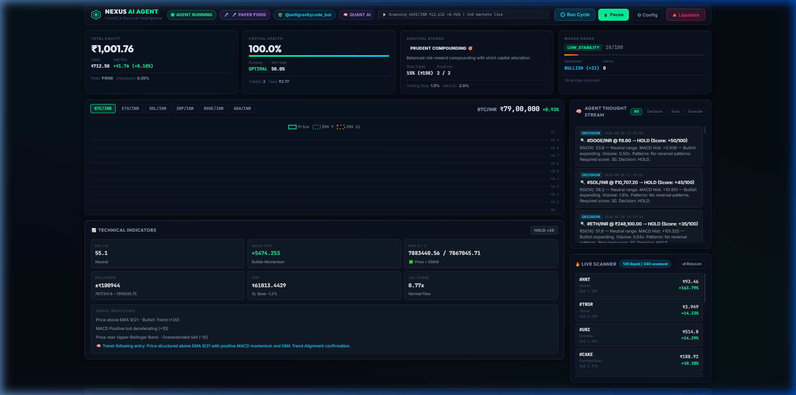
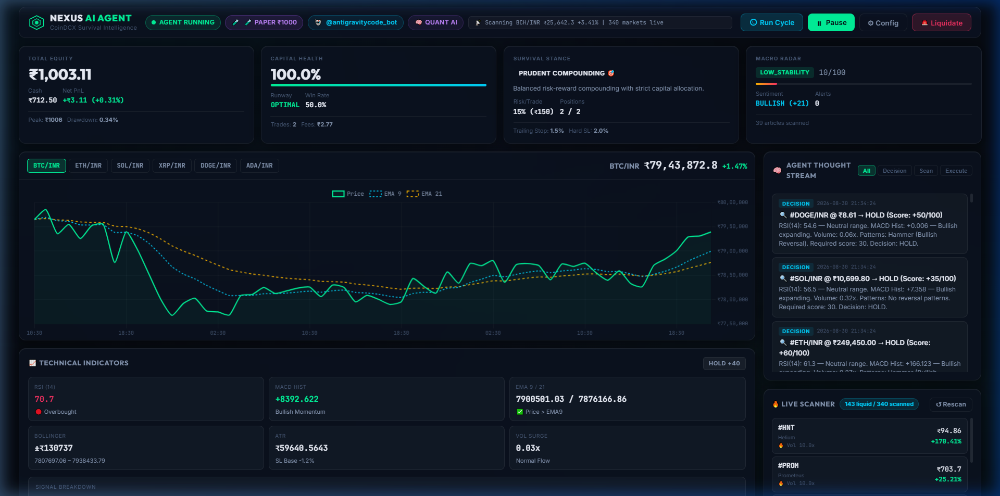
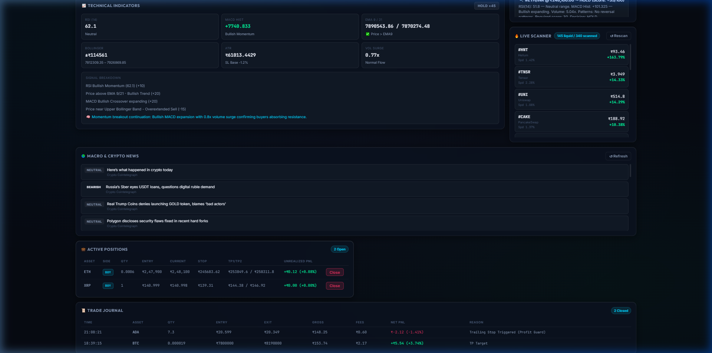
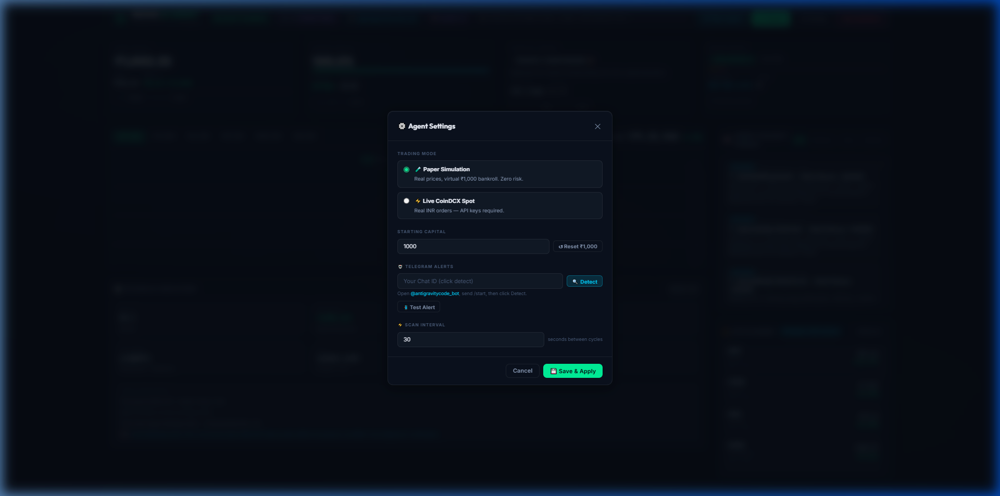

# 🛡️ NEXUS — Autonomous Crypto Survival & Compounding Agent

> **An autonomous quantitative trading and capital-preservation agent built specifically for CoinDCX INR spot markets, starting with ₹1,000 capital compounding.**

---

## 📸 Visual Dashboard Overview



---

## 📑 Table of Contents
1. [Overview & Core Philosophy](#-overview--core-philosophy)
2. [Visual Tour & Screenshots](#-visual-tour--screenshots)
3. [Agent Sub-System Architecture](#-agent-sub-system-architecture)
4. [Telegram Bot Integration & Commands](#-interactive-telegram-bot-system)
5. [The Mathematical Trading Strategy](#-the-mathematical-trading-strategy)
6. [Connecting to MCP (Model Context Protocol)](#-connecting-to-mcp-model-context-protocol)
7. [Quick Start (Installation & Execution)](#-quick-start)
8. [Configuration Reference (`.env`)](#-configuration-reference)

---

## 🎯 Overview & Core Philosophy

Most trading bots fail because they ignore **capital survival** and **macro market regime shifts**. NEXUS is designed with a **Survival-First** mandate:

1. **Capital Preservation > Aggressive Gambling**: Risk per trade is strictly budgeted at 10%–15% (₹100–₹150 on a ₹1,000 starting wallet).
2. **Dynamic Market Scanning**: Continuously sweeps **all 340+ CoinDCX INR pairs** to identify volume surges and momentum breakouts.
3. **Multi-Factor Confluence**: Requires mathematical alignment across RSI, MACD, EMA ribbons, Bollinger Bands, and candlestick patterns.
4. **Automated Risk Shield**: Trailing stops and a 2-tier Take-Profit system that automatically shifts stop-losses to **breakeven (+0.5%)** upon reaching TP1.

---

## 🖼️ Visual Tour & Screenshots

### 1. Live Real-Time Technical Price Chart (Multi-EMA & Volume)

*High-frequency interactive price chart showing dynamic EMA 9/21 ribbons, sub-second price ticks, and multi-factor indicator breakdowns.*

### 2. Active Positions & Trade Journal

*Real-time tracking of active open positions with trailing stop-loss guards, unrealized PnL, and automated trade journaling.*

### 3. Clean Configuration Modal

*Streamlined settings modal for seamless switching between Paper and Live spot trading, capital resetting, and one-click Telegram verification.*

---

## 📱 Interactive Telegram Bot System

NEXUS comes integrated with a 2-way interactive Telegram Bot (`@antigravitycode_bot`) powered by [`core/telegram_notifier.py`](core/telegram_notifier.py).

### 🤖 Supported Interactive Commands

You can send commands directly to your bot on Telegram to query status, inspect scans, or manage risk:

| Command | Description | Example Telegram Output |
|---|---|---|
| `/status` or `/balance` | Instant overview of current equity, cash INR, net PnL %, and active survival stance. | `💎 Total Equity: ₹1,005.32 (Net: +₹5.32 / +0.53%) | Health: 100.0% HP` |
| `/positions` | Lists all active trades with entry price, current price, trailing stop, and unrealized gain. | `🪙 #ETH: Qty 0.0006 \| Entry: ₹2,47,900 \| Current: ₹2,51,999 (+1.65%)` |
| `/scan` or `/movers` | Triggers a live sweep of 340+ CoinDCX INR markets and returns top momentum breakouts. | `🚀 #HNT: +163.79% (₹95.01) \| 24h Vol: ₹4.8L \| Spread: 0.18%` |
| `/cycle` | Forces the trading agent to immediately execute an autonomous scan & evaluation cycle. | `⏳ Executing autonomous cycle on CoinDCX... Cycle Completed!` |
| `/news` | Fetches the latest Geopolitical Threat Radar and global crypto market sentiment score. | `🌍 Threat Level: 20/100 (LOW_RISK) \| Sentiment: +35 (BULLISH)` |
| `/liquidate` | 🚨 **Emergency override**: Instantly closes all open positions into 100% safeguarded INR cash. | `🚨 EMERGENCY LIQUIDATION: Closed 2 positions. Secured Cash: ₹1,005.32` |
| `/start` or `/help` | Displays the interactive command menu and connection status. | *Interactive help and command guide.* |

### ⚡ Automated Instant Push Alerts

The agent automatically sends formatted HTML notifications to your Telegram room on key events:

1. **🚀 Buy Order Alerts**: Triggered instantly when high-conviction momentum or oversold confluence is verified.
2. **💰 Profit / Stop-Loss Alerts**: Sent when TP1, TP2, or a trailing stop is hit, detailing realized PnL, exit reasons, and total wallet balance.
3. **🛡️ Survival Stance Updates**: Dispatched whenever market volatility or drawdown shifts the agent's risk mode (*Bunker, Defensive, Prudent, Expansion*).
4. **🎯 TP1 Breakeven Notifications**: Informs you the moment a position reaches TP1 (+4%) and the stop-loss is automatically adjusted to Breakeven (+0.5%).

---

## 🧩 Agent Sub-System Architecture

NEXUS operates as a coordinated multi-agent system composed of distinct specialized modules:

```
                               ┌────────────────────────┐
                               │   Macro News Radar     │ (RSS Scraping & Geopolitical Threat Level)
                               └───────────┬────────────┘
                                           │
┌────────────────────────┐                 ▼                 ┌────────────────────────┐
│  Live Market Scanner   │ ────► ┌───────────────────┐ ◄──── │  Survival Risk Manager │
│  (340+ CoinDCX Pairs)  │       │    Agent Brain    │       │  (4 Survival Stances)  │
└────────────────────────┘       └─────────┬─────────┘       └────────────────────────┘
                                           │
                                           ▼
┌────────────────────────┐       ┌───────────────────┐       ┌────────────────────────┐
│ Technical Analysis     │ ────► │  Trading Engine   │ ────► │ Telegram Interactive   │
│ Engine (RSI/MACD/EMA)  │       │ (Order Execution) │       │ Bot Notifications      │
└────────────────────────┘       └───────────────────┘       └────────────────────────┘
```

### 1. 📡 Live Market Scanner (`core/market_scanner.py`)
- Sweeps every CoinDCX INR spot market on each cycle.
- Enforces strict liquidity filters: **24h volume > ₹25,000** and **Bid-Ask Spread < 2.5%**.
- Identifies top gainers, volume leaders, and potential explosive breakouts.

### 2. 📊 Technical Analysis Engine (`core/ta_engine.py`)
- Constructs Pandas DataFrames from real-time candlestick data (1h / 15m).
- Computes:
  - **RSI (14)**: Identifies oversold bounce zones ($<35$) and overbought exhaustion ($>70$).
  - **EMA Ribbon (9 / 21 / 50 / 200)**: Detects trend orientation and golden crossovers.
  - **MACD (12, 26, 9)**: Measures momentum acceleration and histogram expansion.
  - **Bollinger Bands (20, 2)**: Quantifies volatility squeezes and mean-reversion extremes.
  - **Average True Range (ATR)**: Sets dynamic, market-adaptive stop losses.
  - **Candlestick Pattern Recognition**: Hammers, Engulfing bars, Morning Stars, and Dojis.
- Produces a normalized **Composite Score (-100 to +100)**.

### 3. 🛡️ Survival Manager & Risk Stances (`core/survival_manager.py`)
Monitors account health ($\text{HP}\%$) and peak-to-trough drawdown to dynamically shift operational stances:

| Stance | Conditions | Max Positions | Allocation | Stop Loss | Trailing Stop |
|---|---|---|---|---|---|
| **🛡️ BUNKER MODE** | HP $<60\%$ or Threat $\ge 75$ or DD $\ge 20\%$ | 0 (Cash only) | 0% | 1.0% | 1.0% |
| **⚖️ DEFENSIVE MODE** | HP $<88\%$ or Threat $\ge 45$ or DD $\ge 10\%$ | 1 | 10% (₹100) | 1.5% | 1.2% |
| **🎯 PRUDENT COMPOUNDING** | Normal market conditions | 2 | 15% (₹150) | 2.0% | 1.5% |
| **🚀 EXPANSION MODE** | Equity $\ge +25\%$ and Win Rate $\ge 60\%$ | 3 | 20% (₹200) | 2.5% | 2.0% |

### 4. 🌍 Macro & Conflict News Radar (`core/news_engine.py`)
- Scrapes live RSS feeds from CoinTelegraph, CoinDesk, Decrypt, and Google World News.
- Detects macroeconomic stress, regulatory crackdowns, or geopolitical conflict spikes to dynamically raise the **Threat Index (0–100)**.

### 5. ⚡ Trading Engine & Order Guard (`core/trading_engine.py`)
- Manages paper trading simulation and live spot execution via authenticated CoinDCX REST APIs.
- **TP1 Trigger**: At $+2.5\%$ to $+3.5\%$, locks in profit and moves stop loss to **Breakeven $+0.5\%$**.
- **TP2 Trigger**: At $+5.0\%$ to $+8.0\%$, executes complete profit exit.
- **Trailing Stop**: Guards high-water marks, automatically tracking rising prices.

---

## 📈 The Mathematical Trading Strategy

### Risk-to-Reward Profile on ₹1,000 Capital:
- **Risk per trade**: ₹1.50 – ₹3.00 (1.5%–2.0% on ₹150 allocation)
- **Reward per trade**: ₹4.50 – ₹10.50 (+3.0%–7.0% on ₹150 allocation)
- **Risk-Reward Ratio**: **1 : 2.5 to 1 : 3.5**
- **Breakeven Win Rate**: Only **~28%** win rate required to not lose money. At a **50% win rate**, the system yields consistent positive portfolio compounding.

---

## 🔌 Connecting to MCP (Model Context Protocol)

NEXUS includes a built-in **Model Context Protocol (MCP) server** (`mcp_server.py`) using JSON-RPC 2.0 over `stdio`. This allows AI assistants (Claude Desktop, Antigravity IDE, Cursor, or Gemini) to query live market data and control the trading agent directly.

### 1. Add to MCP Configuration (`mcp_config.json` or `claude_desktop_config.json`)

```json
{
  "mcpServers": {
    "nexus-crypto-agent": {
      "command": "python",
      "args": ["e:/Agent trading/mcp_server.py"],
      "env": {
        "PYTHONIOENCODING": "utf-8"
      }
    }
  }
}
```

### 2. Available MCP Tools:

| MCP Tool Name | Description | Example Arguments |
|---|---|---|
| `get_portfolio_status` | Returns total equity, cash INR, net PnL, survival health HP %, and active stance. | `{}` |
| `scan_top_movers` | Scans 340+ CoinDCX INR pairs for top gainers and volume spikes. | `{"force_refresh": true}` |
| `analyze_crypto_pair` | Runs RSI, MACD, EMA, Bollinger, and ATR analysis on any CoinDCX pair. | `{"pair": "I-BTC_INR", "interval": "1h"}` |
| `get_macro_conflict_radar` | Returns Geopolitical Threat Level (0-100) and Crypto Sentiment score. | `{}` |
| `execute_paper_trade` | Opens a paper trade with calculated stop-loss and take-profit targets. | `{"market": "SOLINR", "pair": "I-SOL_INR", "symbol": "SOL"}` |
| `emergency_liquidate` | Liquidates all open positions into 100% safeguarded INR cash. | `{}` |
| `get_thought_stream` | Retrieves the live non-repetitive real-time reasoning stream of the agent. | `{"limit": 20}` |

---

## 🚀 Quick Start

### 1. Automated Installation
Double click `install.bat` or run:
```bat
install.bat
```
This verifies your Python 3.10+ setup, upgrades pip, and installs all required dependencies (`fastapi`, `uvicorn`, `pandas`, `numpy`, `requests`, `beautifulsoup4`, `python-dotenv`).

### 2. Launch the Application
Double click `run.bat` or run:
```bat
run.bat
```
This starts:
- The **FastAPI Backend Server** at `http://127.0.0.1:8000`
- The **Autonomous Trading Loop** (running every 30 seconds)
- The **Glassmorphism Web Dashboard** (automatically opened in your default browser)

---

## ⚙️ Configuration Reference

Settings can be managed via the Web UI (click **⚙ Config**) or in `.env`:

```ini
# CoinDCX Credentials (Required only for Live Spot Trading)
COINDCX_API_KEY=your_coindcx_api_key_here
COINDCX_API_SECRET=your_coindcx_api_secret_here

# Trading Engine Settings
DEFAULT_TRADING_MODE=paper        # "paper" or "live"
DEFAULT_INITIAL_CAPITAL=1000.0    # Starting INR wallet
DEFAULT_CYCLE_INTERVAL=30         # Scan interval in seconds

# Telegram Bot Integration
TELEGRAM_BOT_TOKEN=your_telegram_bot_token_here
TELEGRAM_CHAT_ID=621591854
```
